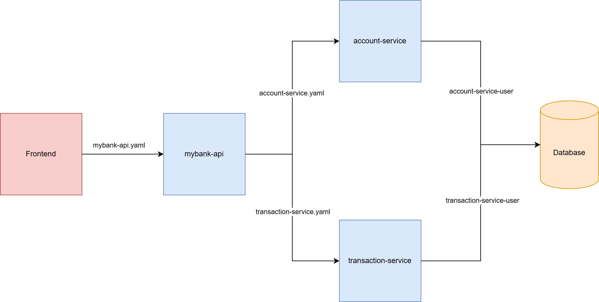
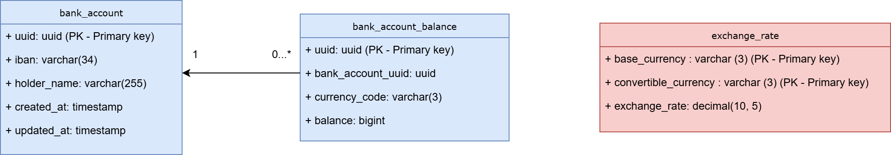

# MyBank Account Handling Services
A project with a microservice architecture for working with bank multi-currency accounts

- [Stack of technologies](#stack-of-technologies)
- [Architecture](#architecture)
- [Running a project on a local machine](#running-a-project-on-a-local-machine)
- [API & Endpoints](#api--endpoints)


## Stack of technologies
- Java 21
- Spring Boot 3
- PostgreSQL
- Liquibase
- OpenAPI Generator
- Docker
- WireMock (for testing)
- RestAssured (for testing)

Instructions on how to run this project are provided below.

## Architecture
**MyBank** software consist of 3 microservices: **MyBankAPI**, **AccountService**, and **TransactionService**.



**MyBankAPI** is a public API communicating with frontend. This service validates frontend requests, handles them, and sends them to internal microservices, which returns a response. **MyBankAPI** does not have a database connection.

**AccountService** is an internal microservice and has no direct communication with the frontend. This service returns a list of bank accounts and related balances in the specific currency. This service has a database connection.

**TransactionService** is an internal microservice and has no direct communication with the frontend. This service makes debit of money from the account, deposit of money to the account, and also deals with online payments. This service has a database connection.

**AccountService** and **TransactionService** do not communicate with each other. They only send an intermediate response to **MyBankAPI**.

## Database
The database of the project consists of 3 tables: Bank accounts, related Bank account balances, and Exchange rates

We store money in cents using BigInteger datatype. This prevents rounding inaccuracies.

The Exchange rates table has a base_currency column. This column is necessary because we use the base currency as an intermediate currency for conversion. This is the approach used by payment systems such as Visa and MasterCard. But we use BigDecimal because in this case, BigInteger gives a big error in conversion.



## Running a project on a local machine
Clone the following projects to your local machine:
- [mybank-api](https://github.com/nikopa96/mybank-api)
- [account-service](https://github.com/nikopa96/account-service)
- [transaction-service](https://github.com/nikopa96/transaction-service)
- [deployment-infra](https://github.com/nikopa96/deployment-infra)

### Running using Docker
1. Go to the deployment-infra project.
2. Run ```docker-compose up``` to run all microservices and a database. MyBankAPI will be run on port 8080.
3. Open the page in your browser: [https://localhost:8080/swagger-ui/index.html](https://localhost:8080/swagger-ui/index.html). On this page you can use all public endpoints of the project.

**IMPORTANT!** All projects must be in the same directory to run Docker Compose. [See screenshot](./readme_resources/project_structure_example.png)

### Running using your IDE
1. Go to the deployment-infra project. Open "dev" folder and run ```docker-compose up``` to install dev dependencies (database)
2. In each project run ```mvn clean package``` to install maven dependencies and compile classes generated by OpenAPI
3. Run each project in your IDE. Ports 8080, 8081 and 8082 must be free.
4. Open the page in your browser: [https://localhost:8080/swagger-ui/index.html](https://localhost:8080/swagger-ui/index.html). On this page you can use all public endpoints of the project.

**IMPORTANT!** This project uses Lombok, so "Enable annotation processing" must be enabled. In the IntelliJ Annotation Processors menu "Obtain processors from project classpath" must be checked for each microservice. [See screenshot](./readme_resources/annotation_processors_help.png)

This project uses OpenAPI Generator to generate DTO and Controller classes. If they are highlighted in "red" in your code, then go to the target/generated-sources folder and mark this folder as "generated source". [See screenshot](./readme_resources/project_structure_help.png)

## API & Endpoints
We have 2 clients in the database: 
| Holder name      | IBAN                  |
|------------------|-----------------------|
| ADAM SMITH       | EE511287154215965472  |
| BEST COMPANY AS  | EE951266739722198152  |

Copy their Holder name (in capital letters) and IBAN to get information from the following endpoints:

You can find IBAN and holder names in the **"bank_account"** database table. The amount of money in a specific currency can be found in the **"bank_account_balance"** table. All preinserted data in the [**import-sample-data.yaml**](https://github.com/nikopa96/account-service/blob/master/src/main/resources/db/changelog/insert-sample-data.yaml) file.

### Get Account Balance with a currency exchange
```POST /accounts/balances/total```

Returns balances in all currencies of the client's multi-currency bank account. Has a feature for exchanging currency balances using fixed conversion rates

Example of request:
```json
{
    "iban": "EE251298943438713614",
    "currencyCode": "USD"
}
```
```iban``` is a search criterion to find the account balance.
```currencyCode``` is the currency into which the money will be converted

Both parameters are required.

If the client does not have a balance in the requested currency, then bodyless 422 Unprocessable entity response will be returned.

### Add Money to Account
```POST /transactions/deposit```

Depositing money into an account in a specific currency. If the client does not have a balance in the requested currency or this account does not exist, the money will not be added and the backend will return 422 Unprocessable Entity with the corresponding response body.

Example of request:
```json
{
    "iban": "EE511287154215965472",
    "holderName": "ADAM SMITH",
    "amount": 123.45,
    "currencyCode": "USD"
}
```
Positive response 200 OK:
```json
{
    "type": "DEPOSIT",
    "success": true
}
```
Negative response 422 Unprocessable entity:
```json
{
    "type": "ACCOUNT_BALANCE_NOT_FOUND",
    "success": false
}
```
All parameters in the request are required. Otherwise, the API returns 400 Bad Request.

### Debit Money from Account
```POST /transactions/debit```

Debiting money from an account in a specific currency. If the client does not have a balance in the requested currency or this account does not exist, the money will not be debited and the backend will return 422 Unprocessable Entity with the corresponding response body.

If the client has an account in a specific currency but does not have enough money funds, then a 422 Unprocessable Entity is returned with the corresponding response body.

Example of request:
```json
{
    "iban": "EE511287154215965472",
    "holderName": "ADAM SMITH",
    "amount": 567.89,
    "currencyCode": "EUR"
}
```
Positive response 200 OK:
```json
{
    "type": "DEBIT",
    "success": true
}
```
Negative response 422 Unprocessable entity:
```json
{
    "type": "NOT_ENOUGH_MONEY",
    "success": false
}
```
All parameters in the request are required. Otherwise, the API returns 400 Bad Request.

### Make online payment
```POST /transactions/onlinepayment```

This endpoint simulates communication with external payment gateway services like Shopify etc. We use https://httpstat.us/ website to simulate callbacks.

If the client does not have a balance in the requested currency or this account does not exist, the money will not be debited and the backend will return 422 Unprocessable Entity with the corresponding response body.

If the client has an account in a specific currency but does not have enough money funds, then a 422 Unprocessable Entity is returned with the corresponding response body.

Example of request:
```json
{
  "transactionInfo": {
    "iban": "EE511287154215965472",
    "holderName": "ADAM SMITH",
    "amount": 567.89,
    "currencyCode": "EUR"
  },
  "callbackURL": "https://httpstat.us/200"
}
```
Positive response 200 OK:
```json
{
    "type": "DEBIT",
    "success": true
}
```
Negative response 422 Unprocessable entity:
```json
{
    "type": "NO_RESPONSE_FROM_PAYMENT_GATEWAY_SERVER",
    "success": false
}
```
All parameters in the request are required. Otherwise, the API returns 400 Bad Request.

If the external gateway service is temporarily unavailable, then we also return 422 status code with a response.
